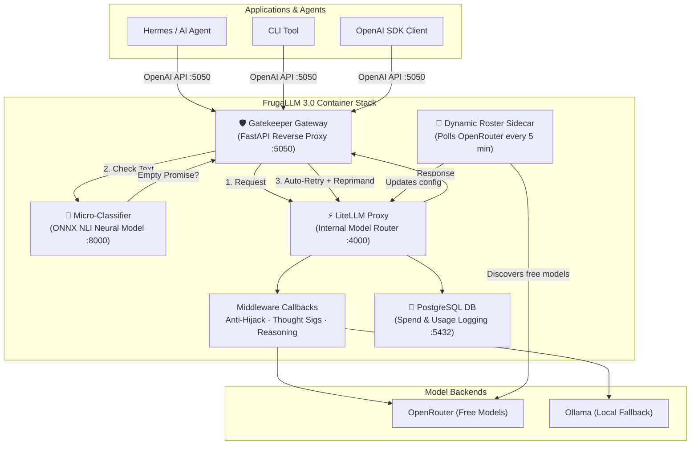

<div align="center">

# 🪙 FrugaLLM 3.0

### Zero-Cost AI Routing Stack with ONNX Semantic Gatekeeping & Automatic Free Model Discovery

*A self-healing containerized LLM gateway stack that automatically discovers and routes through free models on OpenRouter, with zero-shot neural empty-promise classification, intelligent retry gatekeeping, local Ollama fallback, and battle-tested middleware hooks.*

[](LICENSE)
[](https://www.python.org/downloads/)
[](https://www.docker.com/)
[](https://github.com/BerriAI/litellm)

</div>

---

## ✨ What Is This?

FrugaLLM is a containerized, OpenAI-compatible AI gateway stack that **routes your LLM traffic through the best available free models** while guaranteeing tool-calling integrity. It sits between your application (e.g. Hermes, AI Agents, CLI tools) and model backends, providing:

- 🆓 **Zero-Cost Inference** — Automatically discovers and rotates through free models on OpenRouter
- 🛡️ **ONNX Micro-Classifier & Gatekeeper** — Uses a zero-shot NLI neural classifier (`cross-encoder/nli-deberta-v3-small`) and an autonomous reverse-proxy Gatekeeper to catch and auto-retry "empty promise" hallucinations
- 🔄 **Self-Healing Fallback Chains** — If a model rate-limits or fails, the next one picks up instantly
- 🧠 **Reasoning Model Detection** — Heuristically separates reasoning models from balanced ones
- 🔒 **Anti-Hijack Middleware** — Defeats upstream persona injection from free-tier model providers
- 💾 **In-Memory Caching & Telemetry** — Built-in response caching, Langfuse, Prometheus, and PostgreSQL spend logging
- 🏠 **Local Fallback** — Seamless fallback to Ollama when cloud models are exhausted

---

## 🏗️ FrugaLLM 3.0 Architecture

FrugaLLM 3.0 runs as a multi-container Docker Compose stack. Only the **Gatekeeper** is exposed to host applications (`:5050`), keeping internal routing and classifier services isolated on a private bridge network (`frugallm-net`).



---

## 🛡️ Gatekeeper vs. Classifier: How & Why They Work

Small and free-tier LLMs frequently suffer from **"empty promise" hallucinations** — stating in conversational prose that they will run a tool (e.g., *"I will check the files for you..."*) without generating the required JSON `tool_calls` block. 

FrugaLLM 3.0 solves this using a two-tier microservice architecture:

| Component | Architecture & Tech | Role & Behavior | Why It Works |
| :--- | :--- | :--- | :--- |
| **🧠 Micro-Classifier**<br/>*(Port 8000, Internal)* | CPU-optimized **ONNX Runtime** executing `cross-encoder/nli-deberta-v3-small` (baked into container image at build time). | Receives text responses and performs zero-shot Natural Language Inference (NLI) classification to detect intent-to-act vs standard chat text. | **Semantic Accuracy**: Unlike brittle regex rules, the transformer model semantically understands conversational intent with high confidence and sub-millisecond CPU latency. |
| **🛡️ Gatekeeper**<br/>*(Port 5050, Entrypoint)* | **FastAPI Async Reverse Proxy** standing in front of LiteLLM. | Intercepts chat completions, sends non-tool text to the Classifier, and owns the **internal retry loop**. If an empty promise is detected, it injects a system reprimand and retries upstream up to N times automatically. | **Hermes Independence**: The client application never sees intermediate model failures. The Gatekeeper transparently repairs responses before returning them. |
| **⚡ In-Process Callbacks**<br/>*(LiteLLM Layer)* | LiteLLM ASGI middleware & Python callbacks (`custom_callbacks.py`). | Performs Tier 1/2 syntax schema validation, Anti-Hijack persona reinforcement, and Gemini `thought_signature` injection. | **Low-level Sanitization**: Handles payload-level normalization before requests leave for upstream providers. |

---

## 🚀 Quickstart (Docker Compose Stack)

### 1. Clone & Configure

```bash
git clone https://github.com/chorned/frugaLLM.git
cd frugaLLM

# Copy environment configuration
cp .env.example .env

# Edit .env and set your OPENROUTER_API_KEY
nano .env
```

### 2. Launch the Stack

```bash
# Build and start all containers (Gatekeeper, LiteLLM, Classifier, Sidecar, DB)
docker compose up -d

# Watch container startup and logs
docker compose logs -f
```

### 3. Verify Health

```bash
# Health check on the Gatekeeper entrypoint
curl -s http://localhost:5050/health | python3 -m json.tool
```

---

## 🔧 Usage

### OpenAI-Compatible Endpoint

Point your application or OpenAI SDK client to `http://localhost:5050/v1`:

```python
from openai import OpenAI

client = OpenAI(
    base_url="http://localhost:5050/v1",
    api_key="sk-frugallm-master"
)

# Use 'auto' for dynamic free model routing with Gatekeeper protection
response = client.chat.completions.create(
    model="auto",
    messages=[{"role": "user", "content": "Explain quantum computing in 3 bullet points."}]
)

print(response.choices[0].message.content)
```

### Model Aliases

| Alias | Behavior | Fallback Chain |
|---|---|---|
| `auto` | Routes to best available free balanced model | `free_balanced` → Ollama |
| `reasoning` | Routes to best available free reasoning model | `free_reasoning` → Local GPU / Ollama |
| `local` | Direct local Ollama execution | None |
| `pro` | Escalates to paid tier (if configured) | Gemini / Paid providers |
| Direct ID | Passthrough to specific model (e.g. `meta-llama/llama-3.3-70b-instruct:free`) | None |

---

## 📁 Project Structure

```
frugaLLM/
├── docker-compose.yml        # Full 3.0 stack definition (Gatekeeper, Classifier, LiteLLM, Sidecar, DB)
├── Dockerfile.sidecar        # Sidecar container image build
├── Makefile                  # Convenience lifecycle commands
├── README.md                 # System overview and quickstart
├── SKILL.md                  # Agent procedure skill reference
├── classifier/               # 🧠 ONNX zero-shot NLI classifier service
│   ├── app.py
│   ├── Dockerfile
│   └── requirements.txt
├── gatekeeper/               # 🛡️ FastAPI reverse proxy & internal retry engine
│   ├── app.py
│   ├── Dockerfile
│   └── requirements.txt
├── config/                   # Centralized configuration
│   ├── litellm_config.yaml   # Proxy routing & fallback chains
│   └── dynamic_models.yaml   # Auto-generated free model roster
├── frugallm/                 # Core Python modules & custom callbacks
│   ├── custom_callbacks.py   # Anti-hijack & thought signature hooks
│   ├── dynamic_roster_sidecar.py # Free model scanner
│   └── router_cli.py        # CLI interface
└── docs/                     # Documentation & architectural diagrams
```

---

## ⚙️ Key Environment Variables

| Variable | Default | Purpose |
|---|---|---|
| `OPENROUTER_API_KEY` | *(Required)* | OpenRouter API authentication |
| `FRUGALLM_MASTER_KEY` | `sk-frugallm-master` | Proxy API key |
| `LITELLM_URL` | `http://litellm:4000` | Gatekeeper → LiteLLM target URL |
| `CLASSIFIER_URL` | `http://classifier:8000` | Gatekeeper → Classifier target URL |
| `GATEKEEPER_MAX_RETRIES`| `3` | Maximum internal retry attempts on empty promises |
| `FRUGALLM_POLL_INTERVAL`| `300` | Sidecar discovery interval (seconds) |

---

## 🏗️ Built With

- **[LiteLLM](https://github.com/BerriAI/litellm)** — Enterprise OpenAI-compatible routing and proxy engine.
- **[FastAPI](https://fastapi.tiangolo.com/) & [HTTPX](https://www.python-httpx.org/)** — High-performance async gateway and connection pooling.
- **[ONNX Runtime](https://onnxruntime.ai/) & [Hugging Face Optimum](https://huggingface.co/docs/optimum/index)** — Fast CPU neural classification.
- **[DeBERTa-v3 NLI](https://huggingface.co/cross-encoder/nli-deberta-v3-small)** — Zero-shot natural language inference model by Nils Reimers.

---

## 📜 License

[MIT](LICENSE)

