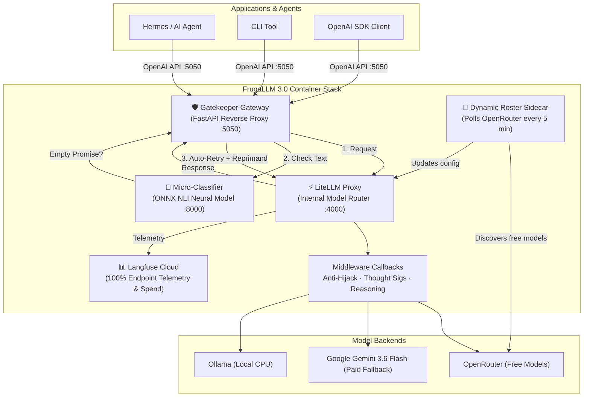

<div align="center">

# 🪙 FrugaLLM 3.0

### Zero-Cost AI Routing Stack with ONNX Semantic Gatekeeping & Automatic Free Model Discovery

*A self-healing containerized LLM gateway stack that automatically discovers and routes through free models on OpenRouter, with zero-shot neural empty-promise classification, intelligent retry gatekeeping, paid Gemini 3.6 Flash terminal fallback, 100% Langfuse telemetry, and intuitive agent pseudo-model aliases.*

[](LICENSE)
[](https://www.python.org/downloads/)
[](https://www.docker.com/)
[](https://github.com/BerriAI/litellm)
[](https://langfuse.com/)

</div>

---

## ✨ What Is This?

FrugaLLM is a containerized, OpenAI-compatible AI gateway stack that **routes your LLM traffic through the best available free models** while guaranteeing tool-calling integrity. It sits between your application (e.g. Hermes, AI Agents, CLI tools) and model backends, providing:

- 🆓 **Zero-Cost Inference** — Automatically discovers and rotates through free models on OpenRouter
- 🛡️ **ONNX Micro-Classifier & Gatekeeper** — Uses a zero-shot NLI neural classifier (`cross-encoder/nli-deberta-v3-small`) and an autonomous reverse-proxy Gatekeeper to catch and auto-retry "empty promise" hallucinations
- 🔄 **Self-Healing Fallback Chains** — If a free model rate-limits or fails, the next one picks up instantly
- ⚡ **Paid Gemini 3.6 Flash Safety Net** — All chains ultimately terminate at paid Gemini 3.6 Flash so requests never fail
- 🤖 **Intuitive Pseudo-Model Aliases** — Simple model names (`frugal`, `thinker`, `cloud`, `offline`, `fast`) that make sense to humans and AI agents
- 🔒 **Anti-Hijack Middleware** — Defeats upstream persona injection from free-tier model providers
- 📊 **100% Langfuse Telemetry** — Full request/response logging, cost tracking, trace context, and model name normalization
- 🧪 **Comprehensive Test Suite** — Live 23+ assertion integration test suite runnable with a single `make test-suite` command

---

## 🏗️ FrugaLLM 3.0 Architecture

FrugaLLM 3.0 runs as a multi-container Docker Compose stack. Only the **Gatekeeper** is exposed to host applications (`:5050`), keeping internal routing and classifier services isolated on a private bridge network (`frugallm-net`).



---

## 🤖 Intuitive Pseudo-Model Aliases

FrugaLLM provides clean, descriptive model aliases designed for AI agents and developers. All existing legacy aliases (`auto`, `reasoning`, `local`, `gemini-flash`, `gemini-pro`) remain **100% backward compatible**.

| Pseudo-Model Alias | Legacy Alias | Routing & Fallback Flow | Primary Use Case |
| :--- | :--- | :--- | :--- |
| **`frugal`** / **`smart`** | `auto` | Local Gemma 4 12B → OpenRouter Free → Paid Gemini 3.6 Flash | General tasks, coding, Q&A (default) |
| **`thinker`** / **`reasoner`** | `reasoning` | Local Gemma 4 12B (CoT) → Free Reasoning → Paid Gemini 3.6 Flash | Deep architecture, math, multi-step planning |
| **`offline`** / **`private`** | `local` | Ollama `hermes:latest` (100% local CPU) | Sensitive data, offline execution |
| **`free`** | `free_balanced` | Top OpenRouter free model (dynamic 5-min pool) | Zero-cost cloud execution |
| **`cloud`** | `gemini-flash` | Paid Gemini 3.6 Flash ($1.50 / $7.50 per 1M) | Guaranteed uptime, 1M context |
| **`fast`** / **`lite`** | `gemini-flash-lite` | Paid Gemini 3.5 Flash-Lite ($0.30 / $2.50 per 1M) | Low latency, high-volume subagent tasks |
| `gemini-pro` | `gemini-pro` | Gemini 2.5 Pro (legacy alias) | Heavy reasoning fallback |

---

## 🚀 Quickstart

### 1. Clone & Configure

```bash
git clone https://github.com/chorned/frugaLLM.git
cd frugaLLM

# Copy environment configuration
cp .env.example .env

# Edit .env and set OPENROUTER_API_KEY and GOOGLE_API_KEY
nano .env
```

### 2. Launch the Stack

```bash
# Build and start all containers (Gatekeeper, LiteLLM, Classifier, Sidecar, DB)
docker compose up -d

# Watch container startup and logs
docker compose logs -f
```

### 3. Verify Health & Run Test Suite

```bash
# Health check on the Gatekeeper entrypoint
curl -s http://localhost:5050/health | python3 -m json.tool

# Run full 23+ assertion integration test suite
make test-suite
```

---

## 🔧 Usage

### OpenAI-Compatible Endpoint

Point any standard OpenAI SDK client to `http://localhost:5050/v1`:

```python
from openai import OpenAI

client = OpenAI(
    base_url="http://localhost:5050/v1",
    api_key="sk-sidecar-1"
)

# Use 'frugal' for intelligent zero-cost auto-routing with Gatekeeper protection
response = client.chat.completions.create(
    model="frugal",
    messages=[{"role": "user", "content": "Explain quantum computing in 3 bullet points."}]
)

print(response.choices[0].message.content)
```

### FrugaLLM Router CLI

Command-line interface for quick terminal interactions:

```bash
# Ask using the default frugal tier
python -m frugallm.router_cli "Explain quantum computing"

# Use the thinker alias for complex reasoning
python -m frugallm.router_cli --thinker "Design a scalable microservice architecture"

# Force cloud tier directly
python -m frugallm.router_cli --cloud "Analyze this document"

# Inspect gateway health & active model roster
python -m frugallm.router_cli --models
```

---

## 🧪 Integration Test Suite

FrugaLLM includes an automated, zero-dependency integration test suite covering 5 distinct test groups:

```bash
# Run all integration tests (health, static models, dynamic models, sidecar, Langfuse)
make test-suite

# Options:
python3 tests/test_integration.py --skip-cloud   # Skip paid cloud API tests
python3 tests/test_integration.py --skip-dynamic  # Skip OpenRouter dynamic model tests
python3 tests/test_integration.py --verbose       # Show full response details
```

### Test Coverage Groups
1. **Infrastructure Health**: Gatekeeper `/health`, LiteLLM `/v1/models`, 401 auth rejection.
2. **Langfuse Telemetry & Tracking**: Config verification, `.env` keys, model name normalization unit tests, Langfuse Cloud reachability, metadata propagation.
3. **Static Model Aliases**: `frugal`, `smart`, `thinker`, `local`, `gemini-flash`, `gemini-flash-lite`, `gemini-pro`, `cloud`, `fast`.
4. **Dynamic Model Aliases**: `free_balanced`, `free_reasoning`, and verification that backup terminals route to Gemini 3.6 Flash.
5. **Sidecar Discovery Logic**: `_is_reasoning_model()` heuristic, YAML generation, OpenRouter pool filtering.

---

## 📁 Project Structure

```
frugaLLM/
├── docker-compose.yml        # Full stack definition (Gatekeeper, Classifier, LiteLLM, Sidecar, DB)
├── Dockerfile.sidecar        # Sidecar container image build
├── Makefile                  # Convenience lifecycle commands (up, down, status, test-suite)
├── README.md                 # System overview and documentation
├── SKILL.md                  # Agent procedure skill reference
├── classifier/               # 🧠 ONNX zero-shot NLI classifier service
│   ├── app.py
│   ├── Dockerfile
│   └── requirements.txt
├── gatekeeper/               # 🛡️ FastAPI reverse proxy & internal retry engine
│   ├── app.py
│   ├── Dockerfile
│   └── requirements.txt
├── config/                   # Centralized configuration
│   ├── litellm_config.yaml   # Proxy routing, aliases & fallback chains
│   └── dynamic_models.yaml   # Auto-generated free model roster
├── frugallm/                 # Core Python modules & custom callbacks
│   ├── custom_callbacks.py   # Anti-hijack, thought sigs, Langfuse normalizer
│   ├── dynamic_roster_sidecar.py # Free model scanner
│   └── router_cli.py        # CLI interface
└── tests/                    # Integration test suite
    └── test_integration.py   # 23+ assertion test runner
```

---

## ⚙️ Key Environment Variables

| Variable | Default | Purpose |
|---|---|---|
| `OPENROUTER_API_KEY` | *(Required)* | OpenRouter API authentication |
| `GOOGLE_API_KEY` | *(Required)* | Google Gemini API key (for Gemini 3.6 Flash fallback) |
| `LANGFUSE_PUBLIC_KEY` | *(Optional)* | Langfuse Cloud public key |
| `LANGFUSE_SECRET_KEY` | *(Optional)* | Langfuse Cloud secret key |
| `LANGFUSE_HOST` | `https://us.cloud.langfuse.com` | Langfuse Cloud host URL |
| `FRUGALLM_MASTER_KEY` | `sk-sidecar-1` | Proxy API key |
| `LITELLM_URL` | `http://litellm:4000` | Gatekeeper → LiteLLM target URL |
| `CLASSIFIER_URL` | `http://classifier:8000` | Gatekeeper → Classifier target URL |
| `GATEKEEPER_MAX_RETRIES`| `3` | Maximum internal retry attempts on empty promises |

---

## 📜 License

[MIT](LICENSE)
