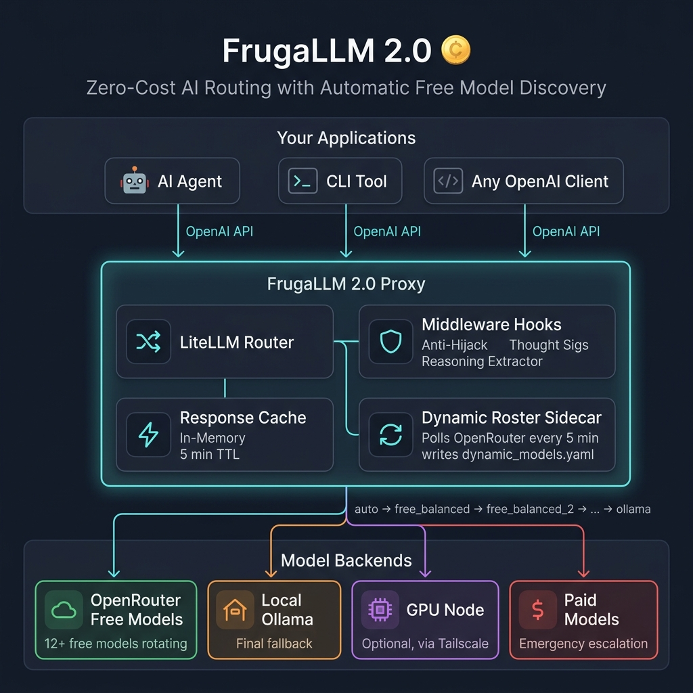

<div align="center">

# 🪙 FrugaLLM 2.0

### Zero-Cost AI Routing with Automatic Free Model Discovery

*A self-healing LLM proxy that automatically discovers and routes through the best available free models on OpenRouter, with local Ollama fallback, intelligent caching, and battle-tested middleware hooks.*

[](LICENSE)
[](https://www.python.org/downloads/)
[](https://github.com/BerriAI/litellm)

</div>

---

## ✨ What Is This?

FrugaLLM is an OpenAI-compatible proxy that **routes your LLM traffic through the best available free models** — automatically. It sits between your application and the cloud, providing:

- 🆓 **Zero-Cost Inference** — Automatically discovers and rotates through free models on OpenRouter
- 🔄 **Self-Healing Fallback Chains** — If a model goes down, the next one picks up instantly
- 🧠 **Reasoning Model Detection** — Heuristically separates reasoning models from balanced ones
- 🛡️ **Anti-Hijack Middleware** — Defeats upstream persona injection from free-tier model providers
- 💾 **In-Memory Response Caching** — Identical prompts get instant responses
- 📊 **Native Telemetry** — Langfuse, Prometheus, and PostgreSQL spend logging out of the box
- 🏠 **Local Fallback** — Falls back to Ollama when all cloud models are exhausted

## 🏗️ Architecture



## 🚀 Quickstart

### Option 1: Manual Setup

```bash
# 1. Clone the repo
git clone https://github.com/chorned/frugaLLM.git
cd frugaLLM

# 2. Create a virtual environment
python3 -m venv venv
source venv/bin/activate

# 3. Install dependencies
pip install -r requirements.txt

# 4. Configure your API keys
cp .env.example .env
# Edit .env and add your OPENROUTER_API_KEY

# 5. Start the proxy
make start

# 6. In a separate terminal, start the sidecar
make sidecar
```

### Option 2: Docker Compose

```bash
# 1. Clone and configure
git clone https://github.com/chorned/frugaLLM.git
cd frugaLLM
cp .env.example .env
# Edit .env and add your OPENROUTER_API_KEY

# 2. Start everything
docker compose up -d

# 3. With PostgreSQL spend logging:
docker compose --profile full up -d
```

### Option 3: macOS LaunchAgent (Always-On)

```bash
# 1. Edit the plist files to set your paths
vim services/com.frugallm.proxy.plist
vim services/com.frugallm.sidecar.plist

# 2. Install and load
cp services/com.frugallm.*.plist ~/Library/LaunchAgents/
launchctl load ~/Library/LaunchAgents/com.frugallm.proxy.plist
launchctl load ~/Library/LaunchAgents/com.frugallm.sidecar.plist
```

## 🔧 Usage

### As an OpenAI-Compatible Endpoint

FrugaLLM exposes a standard OpenAI-compatible API on `http://localhost:4000`:

```python
from openai import OpenAI

client = OpenAI(
    base_url="http://localhost:4000/v1",
    api_key="sk-frugallm-master"  # Your configured master key
)

# Use the "auto" model for automatic free model routing
response = client.chat.completions.create(
    model="auto",
    messages=[{"role": "user", "content": "Explain quantum computing"}]
)
print(response.choices[0].message.content)
```

### Model Aliases

| Alias | Behavior |
|-------|----------|
| `auto` | Routes to the best available free balanced model |
| `reasoning` | Routes to the best available free reasoning model |
| `local` | Forces local Ollama execution (no cloud fallback) |
| `pro` | Escalates to paid tier (if configured) |
| Any model ID | Passthrough to the specific model |

### CLI Tool

```bash
# Quick query
python -m frugallm.router_cli "What is the meaning of life?"

# Pipe from stdin
echo "Explain DNS" | python -m frugallm.router_cli --stdin

# Force reasoning model
python -m frugallm.router_cli -p engineer "Review this code..."

# Check gateway health
python -m frugallm.router_cli --models
```

## 🛡️ Middleware Hooks

FrugaLLM includes three battle-tested middleware hooks that run on every request:

### 1. Anti-Hijack Injection
Many free-tier models on OpenRouter ship with hidden default personas baked into their fine-tuning (e.g., they'll introduce themselves as "OWL" or claim to work for "ZOO company") that can override your own system prompt. This middleware re-appends your system message at the end of the prompt, taking advantage of models' tendency to weight recent instructions more heavily, so **your** persona wins instead of the model's baked-in default.

### 2. Gemini Thought Signatures
Gemini models require a `thought_signature` field on tool calls. If absent, the API returns a 400 error. This middleware ensures the field is always present, mocking it when necessary.

### 3. Reasoning Extractor
OpenRouter and OpenAI-compatible endpoints sometimes return reasoning in hidden fields (`reasoning`, `reasoning_content`). This middleware surfaces them properly so your application can display or log the model's chain-of-thought.

## 📁 Project Structure

```
frugaLLM/
├── config/
│   ├── litellm_config.yaml        # Main LiteLLM proxy configuration
│   └── dynamic_models.yaml        # Auto-generated by the sidecar
├── frugallm/
│   ├── __init__.py
│   ├── custom_callbacks.py        # Middleware hooks (anti-hijack, thought sigs, reasoning)
│   ├── dynamic_roster_sidecar.py  # Free model discovery daemon
│   └── router_cli.py             # CLI wrapper
├── legacy/
│   └── router_server.py          # Original monolithic server (reference only)
├── services/
│   ├── com.frugallm.proxy.plist   # macOS LaunchAgent for the proxy
│   └── com.frugallm.sidecar.plist # macOS LaunchAgent for the sidecar
├── docs/
│   ├── ARCHITECTURE.md
│   ├── CONFIGURATION.md
│   └── TROUBLESHOOTING.md
├── .env.example                   # Environment variable template
├── docker-compose.yml             # Docker deployment
├── Makefile                       # Convenience commands
└── requirements.txt               # Python dependencies
```

## ⚙️ Configuration

See [docs/CONFIGURATION.md](docs/CONFIGURATION.md) for the full reference.

### Key Environment Variables

| Variable | Required | Default | Description |
|----------|----------|---------|-------------|
| `OPENROUTER_API_KEY` | ✅ | — | Your OpenRouter API key |
| `FRUGALLM_MASTER_KEY` | — | `sk-frugallm-master` | Proxy authentication key |
| `FRUGALLM_PROXY_PORT` | — | `4000` | LiteLLM proxy port |
| `FRUGALLM_POLL_INTERVAL` | — | `300` | Sidecar poll interval (seconds) |
| `FRUGALLM_LOCAL_MODEL` | — | `llama3.2:latest` | Local Ollama model |
| `FRUGALLM_LOCAL_URL` | — | `http://127.0.0.1:11434` | Ollama base URL |

## 📊 Telemetry

FrugaLLM supports native telemetry through LiteLLM:

- **Langfuse** — Full request/response tracing with cost tracking
- **Prometheus** — Metrics endpoint for Grafana dashboards
- **PostgreSQL** — Spend logging for cost analytics

Enable by uncommenting the relevant sections in `config/litellm_config.yaml` and setting the required environment variables.

## 🤝 Contributing

Contributions are welcome! Please open an issue or PR.

## 📜 License

[MIT](LICENSE)
